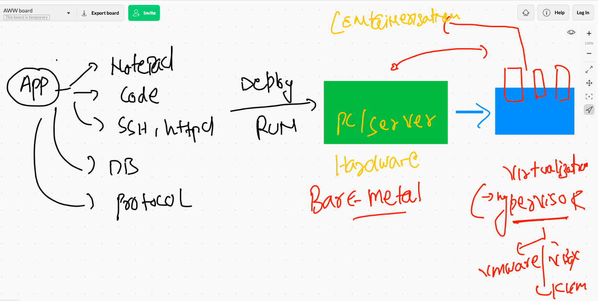
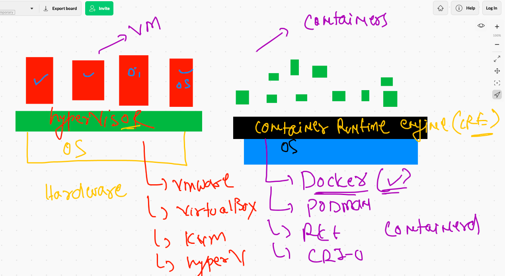
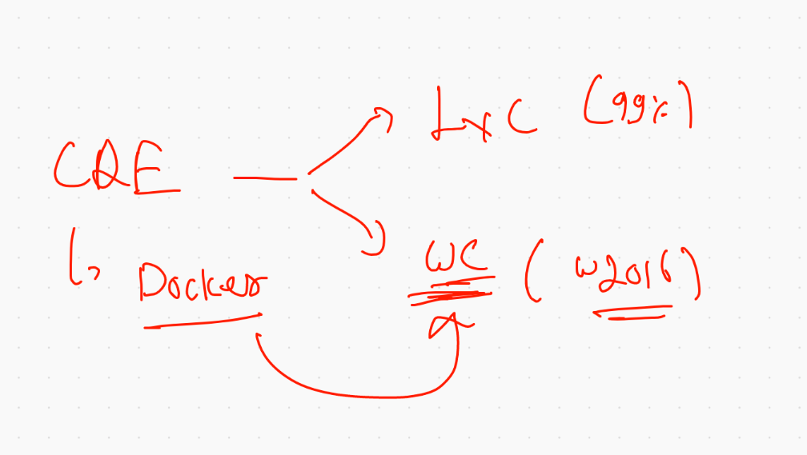
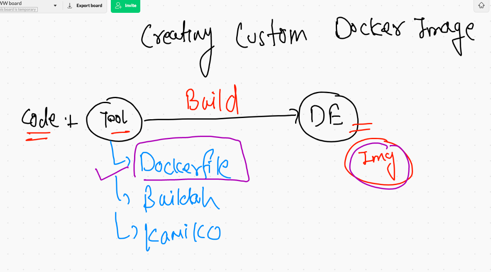
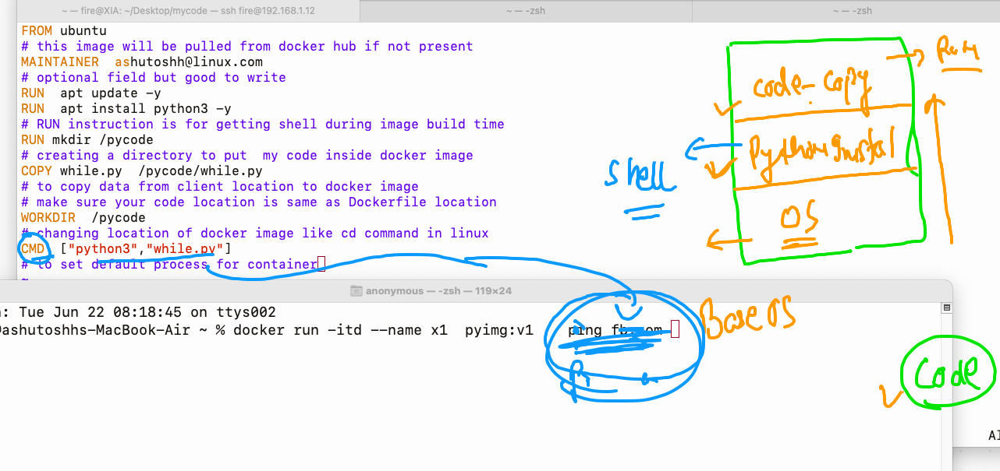

# Application deployment history 

## baremetal to containers



###  vm vs containers



### container reality 



## to check we are connect with docker engine 

``` 
fire@XIA:~$ docker  version 
Client: Docker Engine - Community
 Version:           20.10.6
 API version:       1.41
 Go version:        go1.13.15
 Git commit:        370c289
 Built:             Fri Apr  9 22:47:17 2021
 OS/Arch:           linux/amd64
 Context:           default
 Experimental:      true

Server: Docker Engine - Community
 Engine:
  Version:          20.10.6
  API version:      1.41 (minimum version 1.12)
  Go version:       go1.13.15
  Git commit:       8728dd2
  Built:            Fri Apr  9 22:45:28 2021
  OS/Arch:          linux/amd64
  Experimental:     false
 containerd:
  Version:          1.4.4
  GitCommit:        05f951a3781f4f2c1911b05e61c160e9c30eaa8e
 runc:
  Version:          1.0.0-rc93
  GitCommit:        12644e614e25b05da6fd08a38ffa0cfe1903fdec
 docker-init:
  Version:          0.19.0
  GitCommit:        de40ad0


```

### creating custom docker images



### First dockerfile for python code



### building image from dockerfile

```
 docker  build  -t  ashupython:v1   . 
 
 ```
 
 ### creating container from above created image
 
 ```
  docker run -itd --name ashuc1   ashupython:v1   
 1514  docker  ps
 1515  cat  Dockerfile 
 1516  ls
 1517  history 
fire@XIA:~/Desktop/mycode$ docker  ps
CONTAINER ID   IMAGE            COMMAND                  CREATED          STATUS          PORTS                                                 NAMES
03498ef1b231   ashupython:v1    "python3 while.py"       22 seconds ago   Up 21 seconds                                                         ashuc1

```
### entering into a running container 

```
ire@XIA:~/Desktop/mycode$ docker  exec  -it  ashuc1   bash 
root@03498ef1b231:/pycode# 
root@03498ef1b231:/pycode# 
root@03498ef1b231:/pycode# ls
while.py
root@03498ef1b231:/pycode# ls
while.py
root@03498ef1b231:/pycode# exit
exit

```
