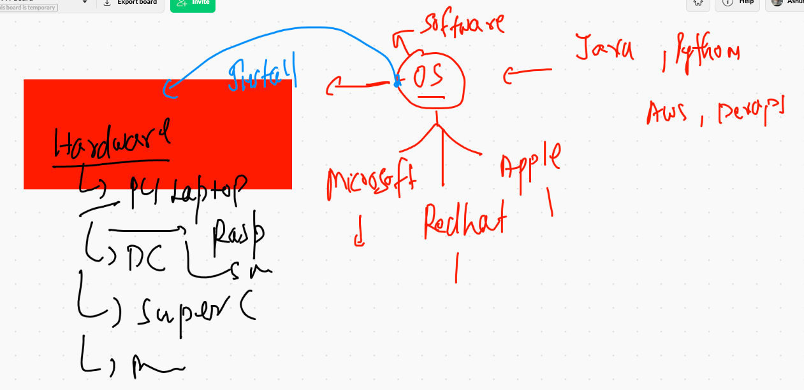
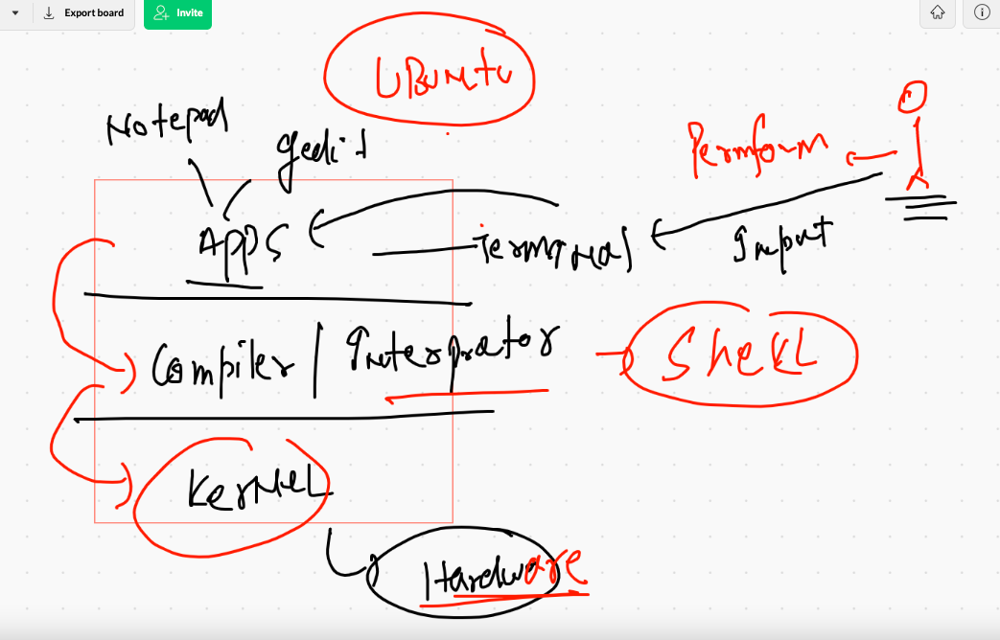
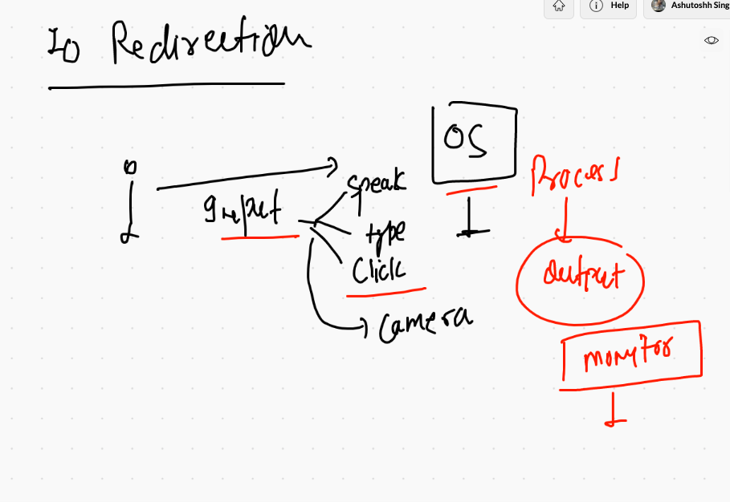
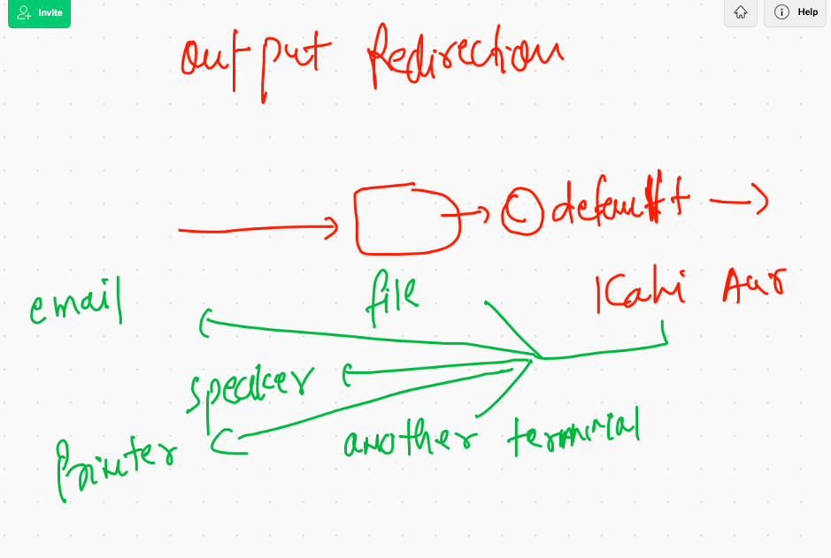
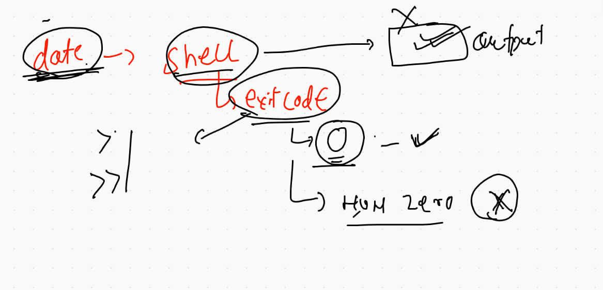
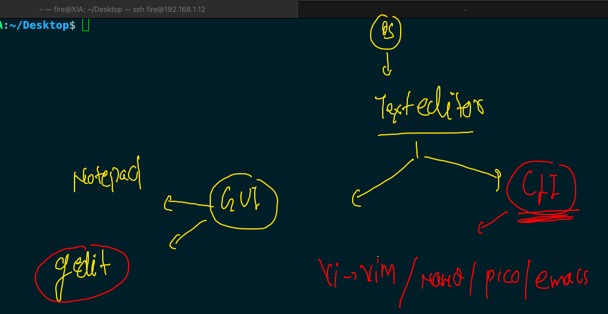
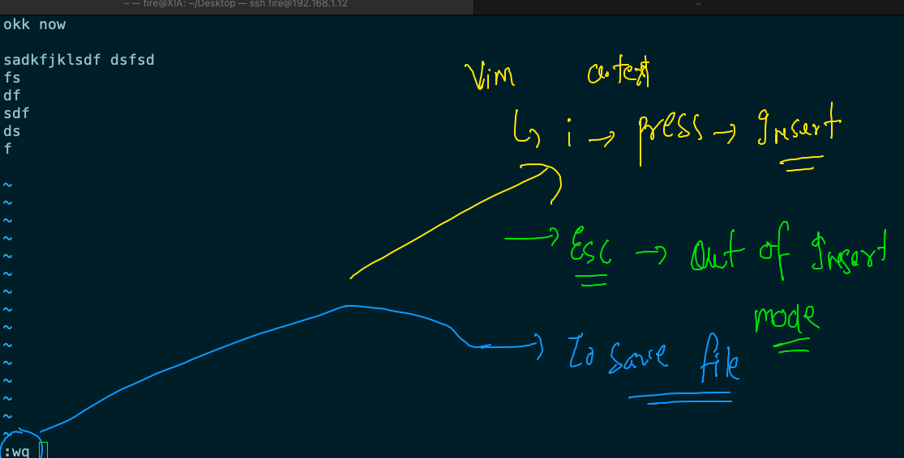

# day4 content of linux session 

## Task 1 


## OS understanding 




## OS interface with shell to kernel 



## Directory structure 


## os commands 

```
fire@XIA:~$ cat  /etc/os-release 
NAME="Ubuntu"
VERSION="20.04.2 LTS (Focal Fossa)"
ID=ubuntu
ID_LIKE=debian
PRETTY_NAME="Ubuntu 20.04.2 LTS"
VERSION_ID="20.04"
HOME_URL="https://www.ubuntu.com/"
SUPPORT_URL="https://help.ubuntu.com/"
BUG_REPORT_URL="https://bugs.launchpad.net/ubuntu/"
PRIVACY_POLICY_URL="https://www.ubuntu.com/legal/terms-and-policies/privacy-policy"
VERSION_CODENAME=focal
UBUNTU_CODENAME=focal

```


### list of env in linux

```
fire@XIA:~$ env
SHELL=/bin/bash
LANGUAGE=en_IN:en
PWD=/home/fire
LOGNAME=fire
XDG_SESSION_TYPE=tty
x=10
MOTD_SHOWN=pam
HOME=/home/fire
LANG=C.UTF-8

```

## IO redirection 



### OUtput redirection 



## Exit code 



### IO commands 

```
whoami 
  531  whoami   >>hello.txt 
  532  cat  hello.txt 
  533  history 
  534  ls
  535  cal  1876    >>ok.txt 
  536  ls
  537  >>aa.txt
  538  >h.txt
  539  ls
  540  rm  -v *.txt 
  541  history 
  542  rm  --help 
  543  date   --help
  544  date
  545  date  +%Y
  546  date  +%B
  547  date  +%A
  548  date --help
  549  history 
  550  date  >a.txt
  551  cal >>b.txt 
  552  ls
  553  rm   *.txt  
  554  cal >>b.txt 
  555  date  >a.txt
  556  rm  -v  *.txt  
  557  history 
  558  ls
  559  date   >nice.txt 
  560  cat  nice.txt 
  561  dateeee    
  562  dateeee    >nice.txt 
  563  date
  564  dateee
  565  xyz
  566  dateee
  567  date
  568  sudo vim /usr/bin/dateee
  569  sudo chmod +x  /usr/bin/dateee
  570  date
  571  dateee
  572  dateee  >nice.txt
  573  date
  574  dateee
  575  dateee   >a.txt
  576  sudo rm  /usr/bin/dateee
  577  date
  578  dateee
  579  date
  580  echo $?
  581  dateee
  582  echo $?
  583  dateee   >nice.txt
  584  whoami
  585  echo $?
  586  cal 
  587  echo $?
  588  cal1 
  589  echo $?
  590  history 
  591  date  >nice.txt
  592  dateee  >>nice.txt 
  593  dateee  2>>nice.txt 
  594  date  2>>nice.txt 
  595  cal   2>>nice.txt 
  596  cal   2>nice.txt 
  597  calsdsdfdf   2>nice.txt 
  
  ```
  
  ## Pipe 
  
  ### example 1
  
  ```
  fire@XIA:~/Desktop$ cal
      May 2021        
Su Mo Tu We Th Fr Sa  
                   1  
 2  3  4  5  6  7  8  
 9 10 11 12 13 14 15  
16 17 18 19 20 21 22  
23 24 25 26 27 28 29  
30 31                 
fire@XIA:~/Desktop$ cal  |  wc  -l
8
fire@XIA:~/Desktop$ cal  |  wc  -w
40
fire@XIA:~/Desktop$ cal  |  wc  -c
188
fire@XIA:~/Desktop$ cal  |  wc 
      8      40     188

```

### Text editor



### about vim 



### example 2 to grep 

```
 cat  /etc/shells 
  618  cat  /etc/shells   |   grep bash
  619  cat  /etc/shells   |   grep bash  >filewithonlybash.txt
  620  cat  /etc/shells   |   grep bash
  621  ls
  622  nano  okkk.txt 
  623  cat okkk.txt 
  624  cal1
  625  vim   kk.txt 
  626  cat kk.txt 
  627  cat kk.txt   |   grep  hello 
  628  cat kk.txt   |   grep -i  hello 
  629  cat kk.txt   |   grep -v  hello 
  630  cat kk.txt   |   grep -v -i  hello 
  631  history 
  632  ls
  633  grep  -i hello kk.txt 
  634  history 
  635  cal 
  636  cal   |   grep  19 

```


