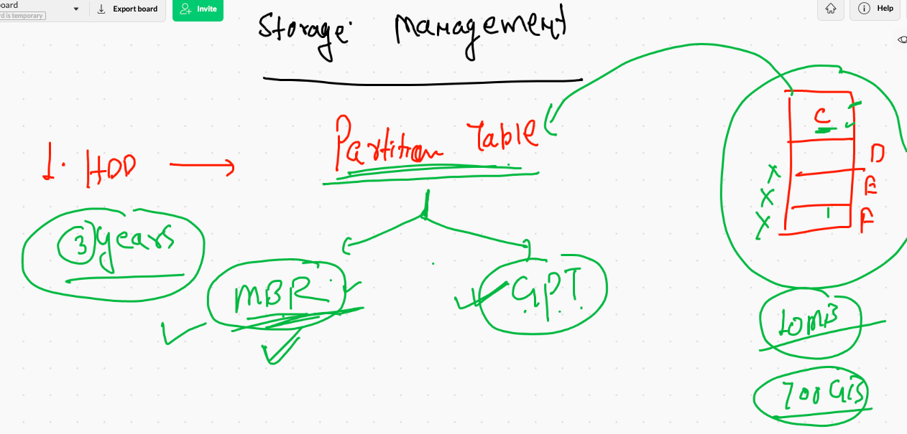
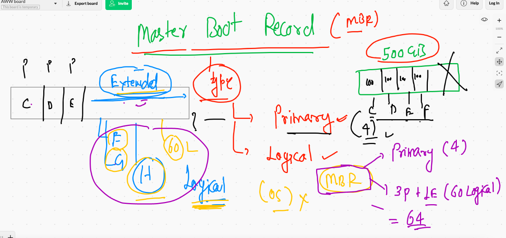
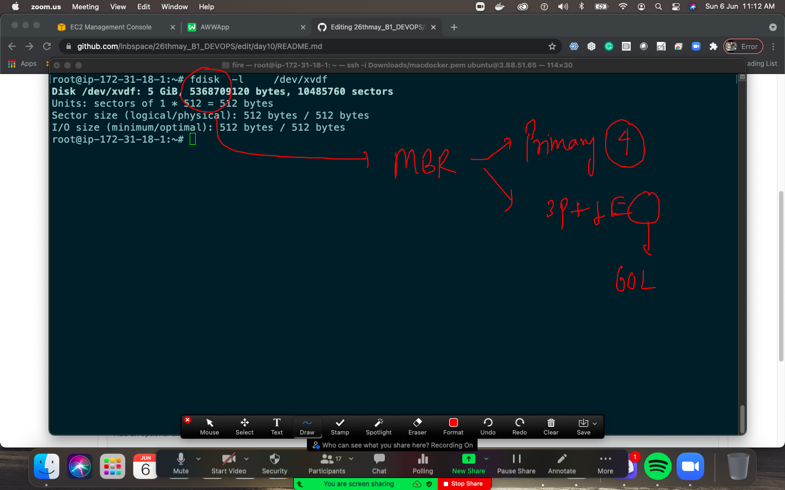
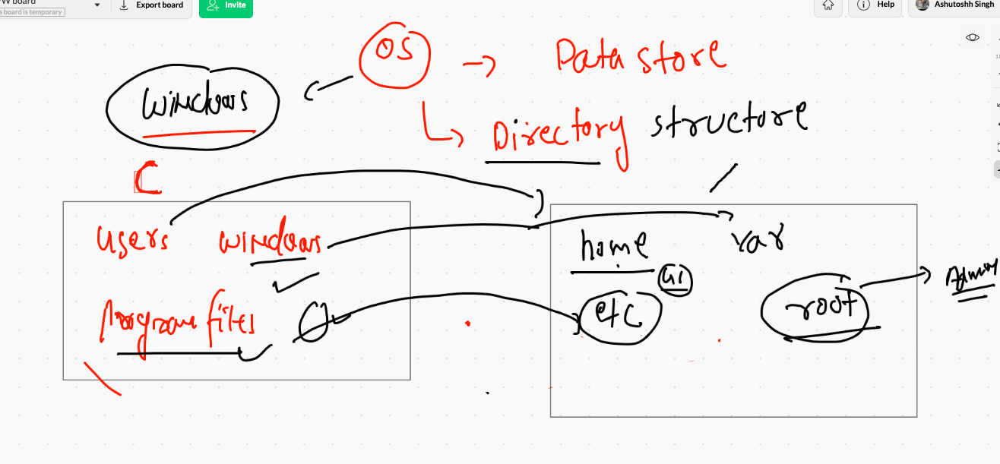
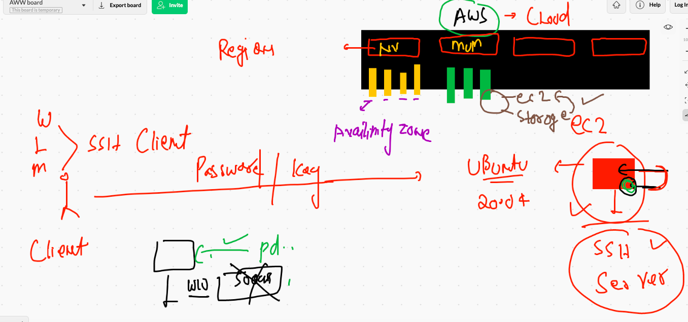
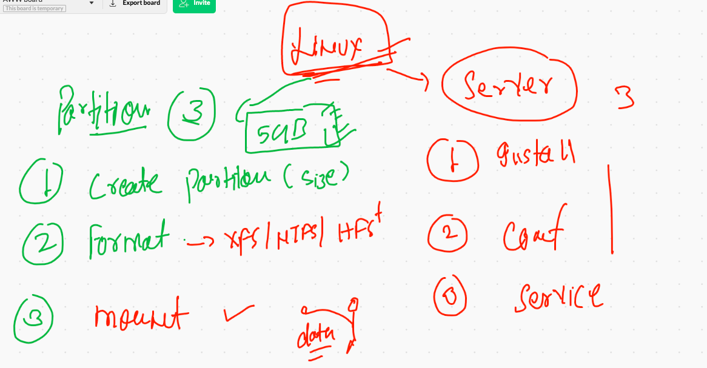
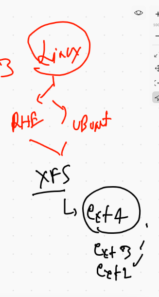
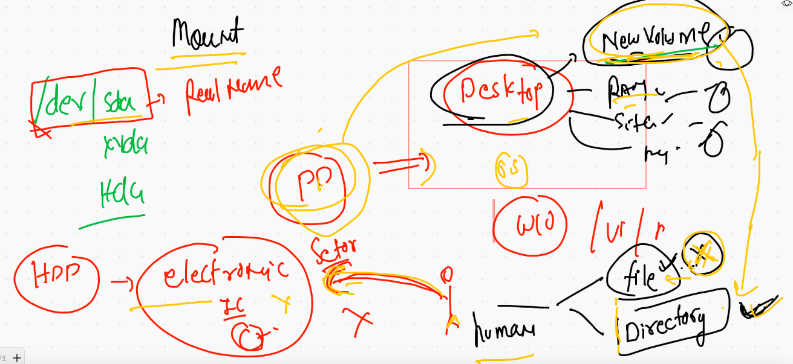

# Plz don't add any data in main branch 

## Enjoy core learning 

## COncept of Partition table  there are huge number of partition tables 

### we are discussing about only 2 




### MBR 



## Fdisk using for linux based mbr partition in aws ec2 instance 



##  Directory structure 




## Creating partition in Aws cloud ec2 instance



### creating partition in linux steps



## steps 

### list number of hdd 

```
fdisk -l 

Disk /dev/xvda: 8 GiB, 8589934592 bytes, 16777216 sectors
Units: sectors of 1 * 512 = 512 bytes
Sector size (logical/physical): 512 bytes / 512 bytes
I/O size (minimum/optimal): 512 bytes / 512 bytes
Disklabel type: dos
Disk identifier: 0x5198cbc0

Device     Boot Start      End  Sectors Size Id Type
/dev/xvda1 *     2048 16777182 16775135   8G 83 Linux


Disk /dev/xvdf: 5 GiB, 5368709120 bytes, 10485760 sectors
Units: sectors of 1 * 512 = 512 bytes
Sector size (logical/physical): 512 bytes / 512 bytes
I/O size (minimum/optimal): 512 bytes / 512 bytes

```


### step1. create partition 


### creating partition 

```
root@ip-172-31-18-1:~# fdisk    -l  /dev/xvdf
Disk /dev/xvdf: 5 GiB, 5368709120 bytes, 10485760 sectors
Units: sectors of 1 * 512 = 512 bytes
Sector size (logical/physical): 512 bytes / 512 bytes
I/O size (minimum/optimal): 512 bytes / 512 bytes
Disklabel type: dos
Disk identifier: 0xcde7942e

Device     Boot   Start     End Sectors  Size Id Type
/dev/xvdf1         2048 1026047 1024000  500M 83 Linux
/dev/xvdf2      1026048 3123199 2097152    1G 83 Linux

```

### step 2 format partition created in above step 



### with XFS 

```
root@ip-172-31-18-1:~# mkfs.xfs   /dev/xvdf1     
meta-data=/dev/xvdf1             isize=512    agcount=4, agsize=32000 blks
         =                       sectsz=512   attr=2, projid32bit=1
         =                       crc=1        finobt=1, sparse=1, rmapbt=0
         =                       reflink=1
data     =                       bsize=4096   blocks=128000, imaxpct=25
         =                       sunit=0      swidth=0 blks
naming   =version 2              bsize=4096   ascii-ci=0, ftype=1
log      =internal log           bsize=4096   blocks=1368, version=2
         =                       sectsz=512   sunit=0 blks, lazy-count=1
realtime =none                   extsz=4096   blocks=0, rtextents=0

```

### with vfat 

```
root@ip-172-31-18-1:~# mkfs.vfat /dev/xvdf2 
mkfs.fat 4.1 (2017-01-24)
root@ip-172-31-18-1:~# 

```

### step 3. Mounting 



```
root@ip-172-31-18-1:~# mkdir  /mnt/ashu
root@ip-172-31-18-1:~# 
root@ip-172-31-18-1:~# mount   /dev/xvdf1   /mnt/ashu/

```

## DOne 

## tips 

### checking mounted partition 

```
root@ip-172-31-18-1:~# df -h
Filesystem      Size  Used Avail Use% Mounted on
/dev/root       7.7G  1.5G  6.3G  19% /
devtmpfs        484M     0  484M   0% /dev
tmpfs           490M     0  490M   0% /dev/shm
tmpfs            98M  800K   98M   1% /run
tmpfs           5.0M     0  5.0M   0% /run/lock
tmpfs           490M     0  490M   0% /sys/fs/cgroup
/dev/loop0       34M   34M     0 100% /snap/amazon-ssm-agent/3552
/dev/loop1       56M   56M     0 100% /snap/core18/1997
/dev/loop2       71M   71M     0 100% /snap/lxd/19647
/dev/loop3       33M   33M     0 100% /snap/snapd/11588
/dev/loop4       33M   33M     0 100% /snap/snapd/12057
/dev/loop5       56M   56M     0 100% /snap/core18/2066
/dev/loop6       68M   68M     0 100% /snap/lxd/20326
tmpfs            98M     0   98M   0% /run/user/1000
/dev/xvdf1      495M   29M  466M   6% /mnt/ashu
/dev/xvdf2     1022M  4.0K 1022M   1% /mnt/lnb

```

### 

```
root@ip-172-31-18-1:~# df -hT
Filesystem     Type      Size  Used Avail Use% Mounted on
/dev/root      ext4      7.7G  1.5G  6.3G  19% /
devtmpfs       devtmpfs  484M     0  484M   0% /dev
tmpfs          tmpfs     490M     0  490M   0% /dev/shm
tmpfs          tmpfs      98M  800K   98M   1% /run
tmpfs          tmpfs     5.0M     0  5.0M   0% /run/lock
tmpfs          tmpfs     490M     0  490M   0% /sys/fs/cgroup
/dev/loop0     squashfs   34M   34M     0 100% /snap/amazon-ssm-agent/3552
/dev/loop1     squashfs   56M   56M     0 100% /snap/core18/1997
/dev/loop2     squashfs   71M   71M     0 100% /snap/lxd/19647
/dev/loop3     squashfs   3

```
## note : user typescript and partition.txt by 

```
scriptreplay  partitiion.txt  # make sure both file are at same location 

```


