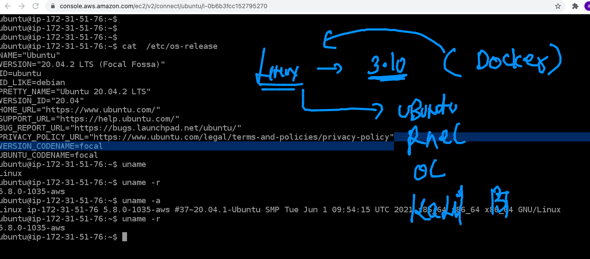
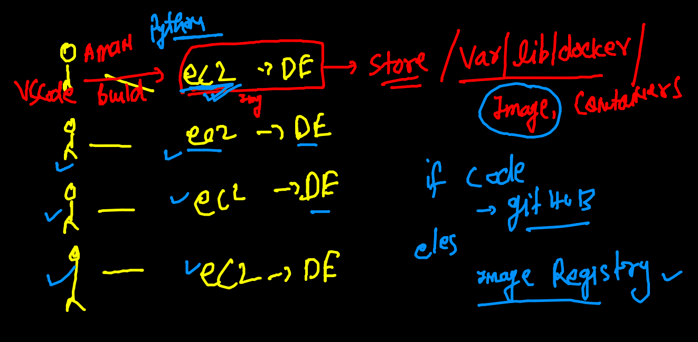
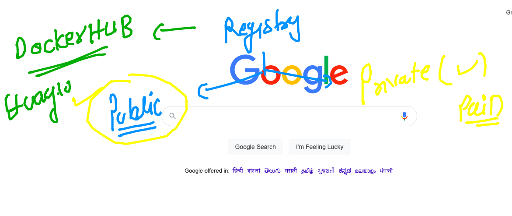
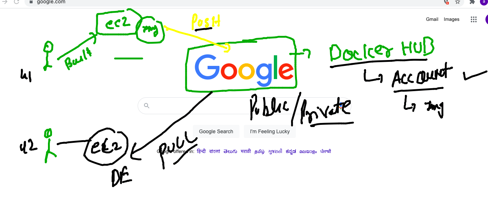
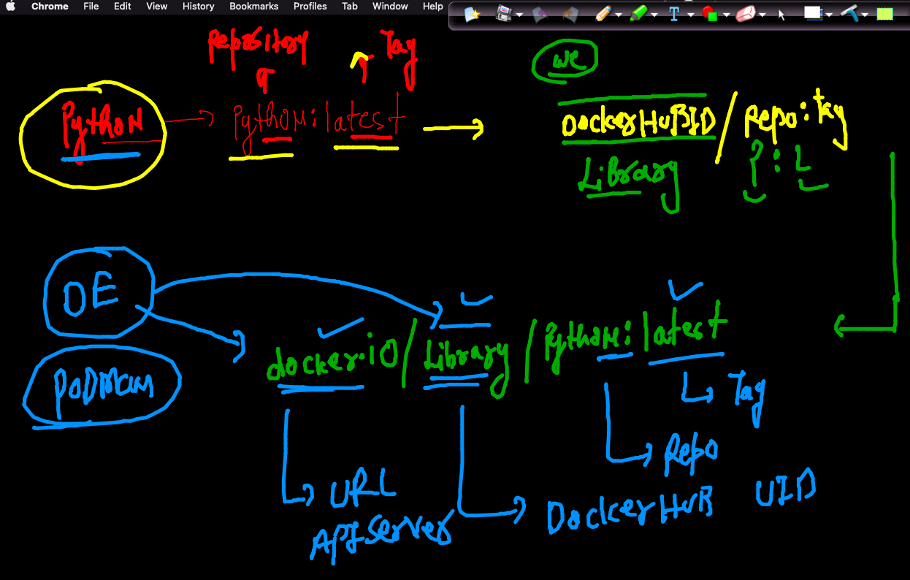

# Docker more Information 

##  Kernel Version 


## image registry 



## Introduction to Docker hub 



### image pushing process



### image name reality 



## commands to remove images and container 

```
 113  docker  ps  -a -q
  114  docker  rm  $(docker  ps  -a -q)
  115  docker  ps -a
  116  docker  images
  117  docker  rmi  d4ff818577bc
  118  docker  images
  
```

### steps to push docker image on docker hub 

```
ubuntu@ip-172-31-51-76:~$ docker  tag   ashuhttpd:v1   dockerashu/ashuhttpd:v1  
ubuntu@ip-172-31-51-76:~$ docker  images
REPOSITORY             TAG       IMAGE ID       CREATED        SIZE
dockerashu/ashuhttpd   v1        892e93144045   47 hours ago   252MB
ashuhttpd              v1        892e93144045   47 hours ago   252MB
ashupy                 v2        5d032bdd5dd0   2 days ago     886MB
ashupy                 v1        ac2a14093af5   2 days ago     141MB
ubuntu                 latest    9873176a8ff5   7 days ago     72.7MB
alpine                 latest    d4ff818577bc   9 days ago     5.6MB
python                 latest    5b3b4504ff1f   4 weeks ago    886MB
centos                 latest    300e315adb2f   6 months ago   209MB
ubuntu@ip-172-31-51-76:~$ docker  login -u dockerashu 
Password: 
WARNING! Your password will be stored unencrypted in /home/ubuntu/.docker/config.json.
Configure a credential helper to remove this warning. See
https://docs.docker.com/engine/reference/commandline/login/#credentials-store

Login Succeeded
ubuntu@ip-172-31-51-76:~$ docker  push dockerashu/ashuhttpd:v1 
The push refers to repository [docker.io/dockerashu/ashuhttpd]
17a393eda6af: Pushed 
d83e33d80f62: Pushed 
2653d992f4ef: Mounted from library/centos 
v1: digest: sha256:970f293f76ef3b8b4f1894716b79c4a1b0580e8059e51910d262d9c297cdf19f size: 948
ubuntu@ip-172-31-51-76:~$ docker  logout 
Removing login credentials for https://index.docker.io/v1/

```

