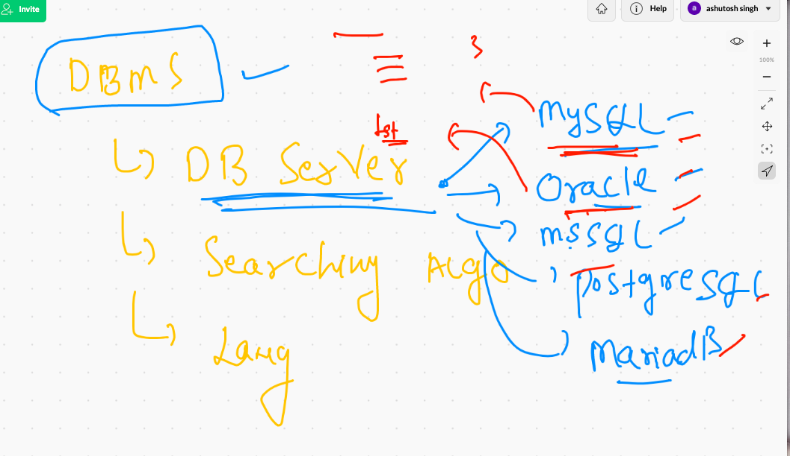
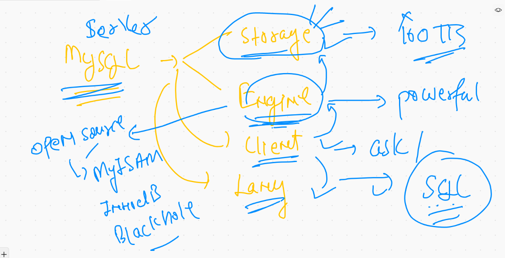
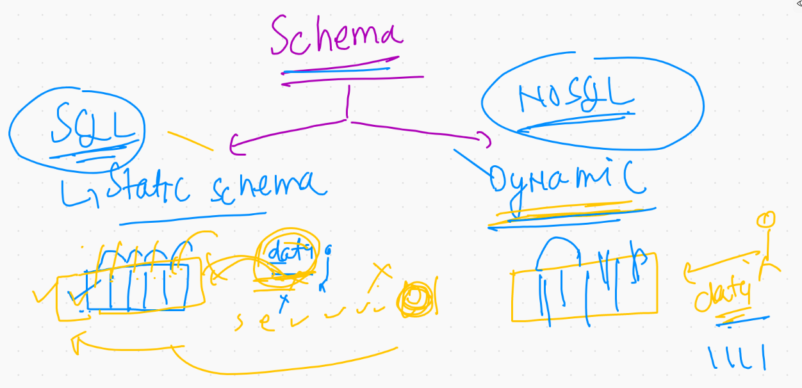
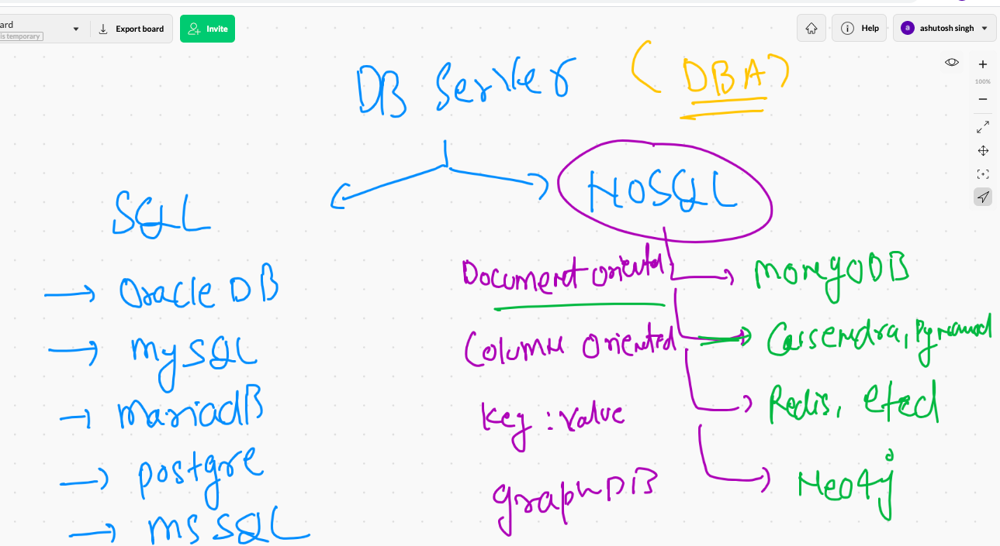
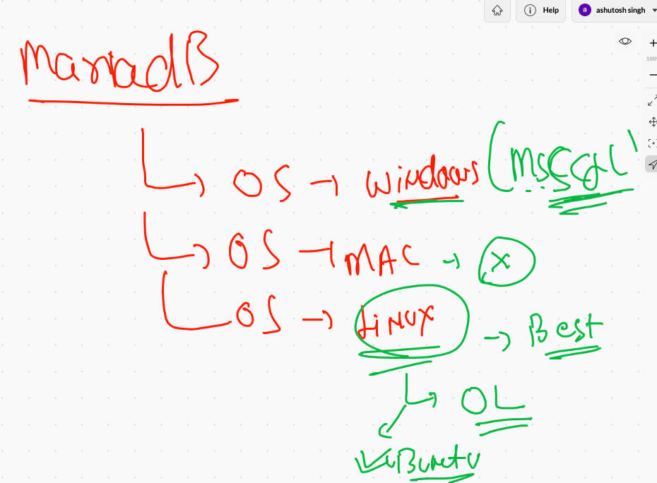
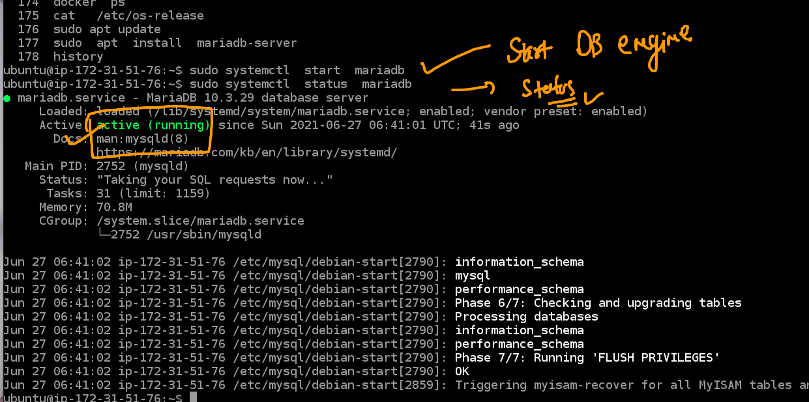
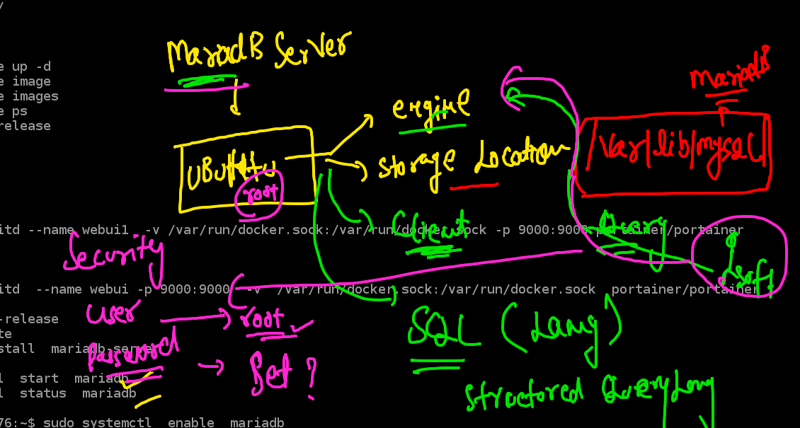
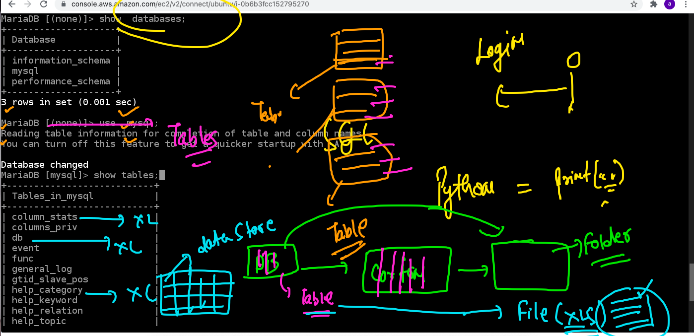

# Database servers



## Db server and their engines 



##  SQL vs NOsql 




## Big picture of DB



## OS selection for DB



## Steps to install Mariadb server on Ubuntu machine 

### step 1

```
ubuntu@ip-172-31-51-76:~$ sudo apt update
Hit:1 http://us-east-1.ec2.archive.ubuntu.com/ubuntu focal InRelease
Get:2 http://us-east-1.ec2.archive.ubuntu.com/ubuntu focal-updates InRelease [114 kB]                                       
Get:3 http://us-east-1.ec2.archive.ubuntu.com/ubuntu focal-backports InRelease [101 kB]                                     
Get:4 http://security.ubuntu.com/ubuntu focal-security InRelease [114 kB]                                                   
Hit:5 https:

```


### step 2 :


```
ubuntu@ip-172-31-51-76:~$ sudo  apt  install  mariadb-server  
Reading package lists... Done
Building dependency tree       
Reading state information... Done
The following packages were automatically installed and are no longer required:
  python3-cached-property python3-docker python3-dockerpty python3-docopt python3-texttable python3-websocket
Use 'sudo apt autoremove' to remove them.
The following additional packages will be installed:
  galera-3 libcgi-fast-perl libcgi-pm-perl libconfig-inifiles-perl libdbd-mysql-perl libdbi-perl libencode-locale-perl
  libfcgi-perl libhtml-parser-perl libhtml-tagset-perl libhtml-template-perl libhttp-date-perl libhttp-message-perl
  libio-html-perl liblwp-mediatypes-perl libmysqlclient21 libsnappy1v5 libterm-readkey-perl libtimedate-perl liburi-perl
  mariadb-client-10.3 mariadb-client-core-10.3 mariadb-common mariadb-server-10.3 mariadb-server-core-10.3 mysql-common
  socat
Suggested packages:
  libclone-perl libmldbm-perl libnet-daemon-perl libsql-statement-perl libdata-dump-perl libipc-sharedcache-perl
  libwww-perl mailx mariadb-test tinyca
The following NEW packages will be installed:
  galera-3 libcgi-fast-perl libcgi-pm-perl libconfig-inifiles-perl libdbd-mysql-perl libdbi-perl libencode-locale-perl
  libfcgi-perl libhtml-parser-perl libhtml-tagset-perl libhtml-template-perl libhttp-date-perl libhttp-message-perl
  libio-html-perl liblwp-mediatypes-perl libmysqlclient21 libsnappy1v5 libterm-readkey-perl libtimedate-perl liburi-perl
  mariadb-client-10.3 mariadb-client-core-10.3 mariadb-common mariadb-server mariadb-server-10.3 mariadb-server-core-10.3
  mysql-common socat
0 upgraded, 28 newly installed, 0 to remove and 44 not upgraded.
Need to get 21.2 MB of archives.
After this operation, 173 MB of additional disk space will be used.
Do you want to continue? [Y/n] y
```

### step 3 

```
ubuntu@ip-172-31-51-76:~$ sudo systemctl  start  mariadb
ubuntu@ip-172-31-51-76:~$ sudo systemctl  status  mariadb
● mariadb.service - MariaDB 10.3.29 database server
     Loaded: loaded (/lib/systemd/system/mariadb.service; enabled; vendor preset: enabled)
     Active: active (running) since Sun 2021-06-27 06:41:01 UTC; 41s ago
       Docs: ma
```

### screenshot 




### COnnecting DB server from Client 



### securing db server

```
root@ip-172-31-51-76:~# mysql_secure_installation 

NOTE: RUNNING ALL PARTS OF THIS SCRIPT IS RECOMMENDED FOR ALL MariaDB
      SERVERS IN PRODUCTION USE!  PLEASE READ EACH STEP CAREFULLY!

In order to log into MariaDB to secure it, we'll need the current
password for the root user.  If you've just installed MariaDB, and
you haven't set the root password yet, the password will be blank,
so you should just press enter here.

Enter current password for root (enter for none): 
OK, successfully used password, moving on...

Setting the root password ensures that nobody can log into the MariaDB
root user without the proper authorisation.

Set root password? [Y/n] y
New password: 
Re-enter new password: 
Sorry, passwords do not match.

New password: 
Re-enter new password: 
Password updated successfully!
Reloading privilege tables..
 ... Success!


```

## Now time for interaction with DB server 


### login into Db server

```
root@ip-172-31-51-76:~# mysql  -u  root  -p 
Enter password: 
Welcome to the MariaDB monitor.  Commands end with ; or \g.
Your MariaDB connection id is 36
Server version: 10.3.29-MariaDB-0ubuntu0.20.04.1 Ubuntu 20.04

Copyright (c) 2000, 2018, Oracle, MariaDB Corporation Ab and others.

Type 'help;' or '\h' for help. Type '\c' to clear the current input statement.

MariaDB [(none)]> 

```

### using SQL to interact with DB 




