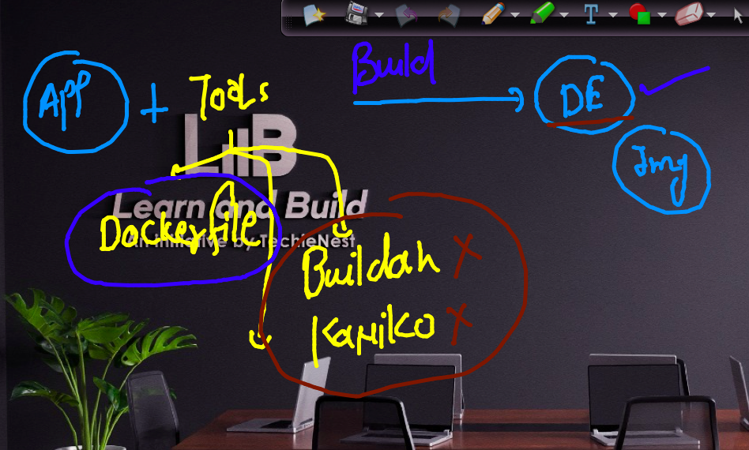
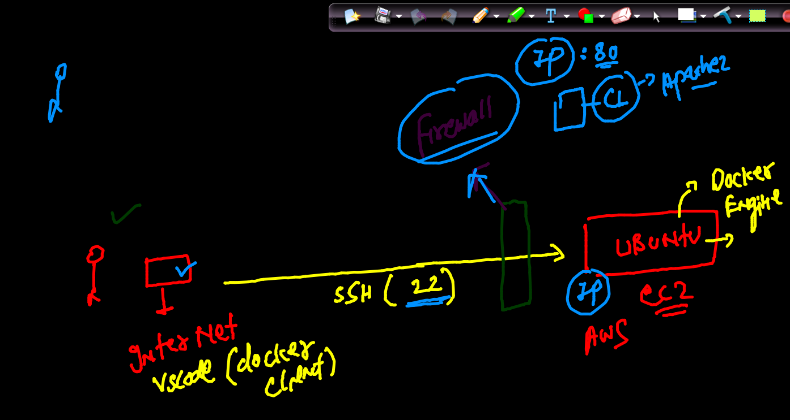
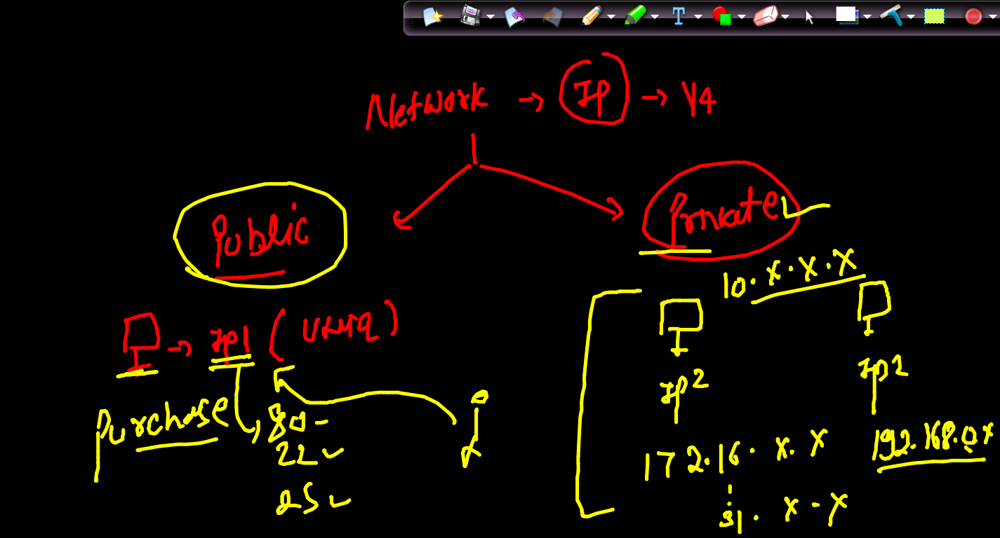
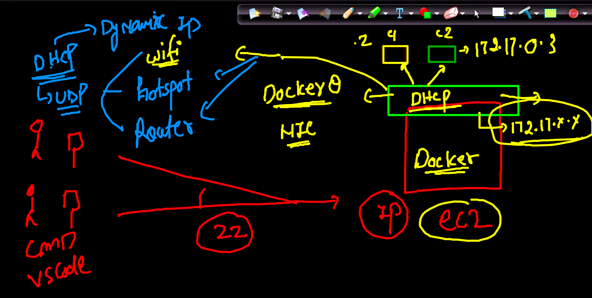
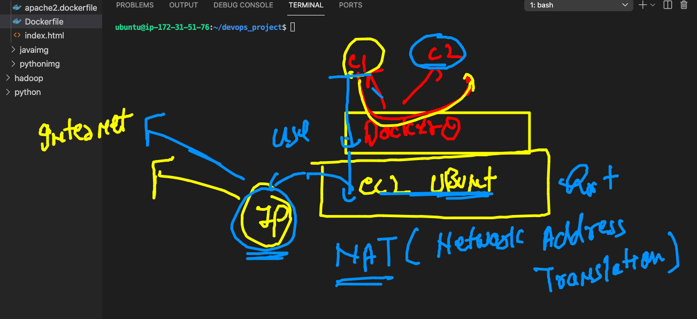
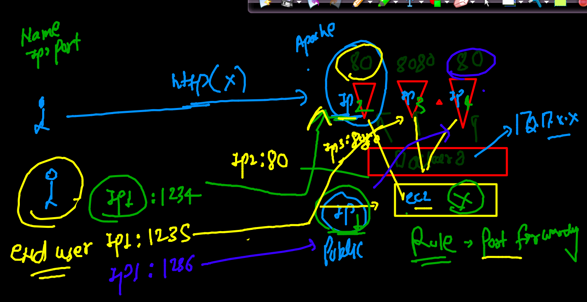

# COntainer image building options 


### options 



## Ec2 and container networking 



### Networking pubic and private IP concept 



### COntainers will get private IP from Docker 0 Bridge that got created by Docker it self during installation time 



### Nat behind the scene 



### to check ip address of any container 
```
ubuntu@ip-172-31-51-76:~/devops_project$ docker  inspect   ashuc1   --format='{{.NetworkSettings.IPAddress}}'
172.17.0.2
ubuntu@ip-172-31-51-76:~/devops_project$ docker  inspect   ashuc2  --format='{{.NetworkSettings.IPAddress}}'
172.17.0.3
ubuntu@ip-172-31-51-76:~/devops_project$ 
```

### POrt forwarding in container 



