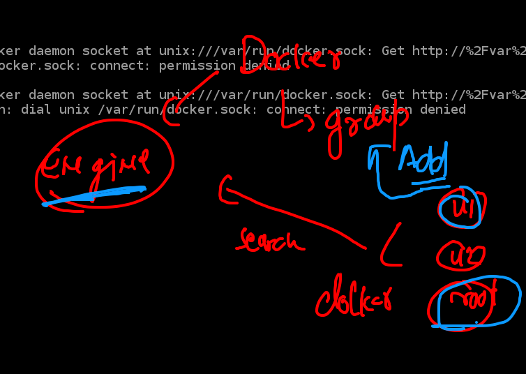
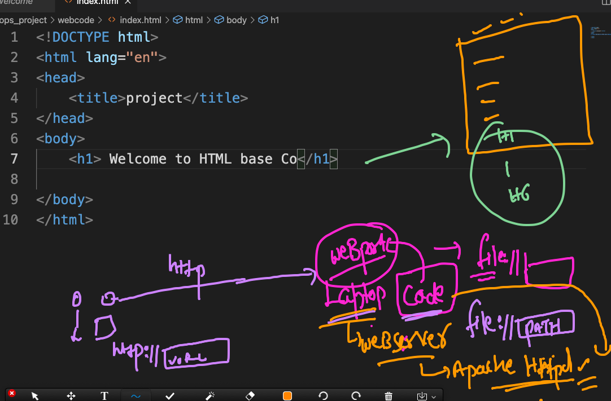
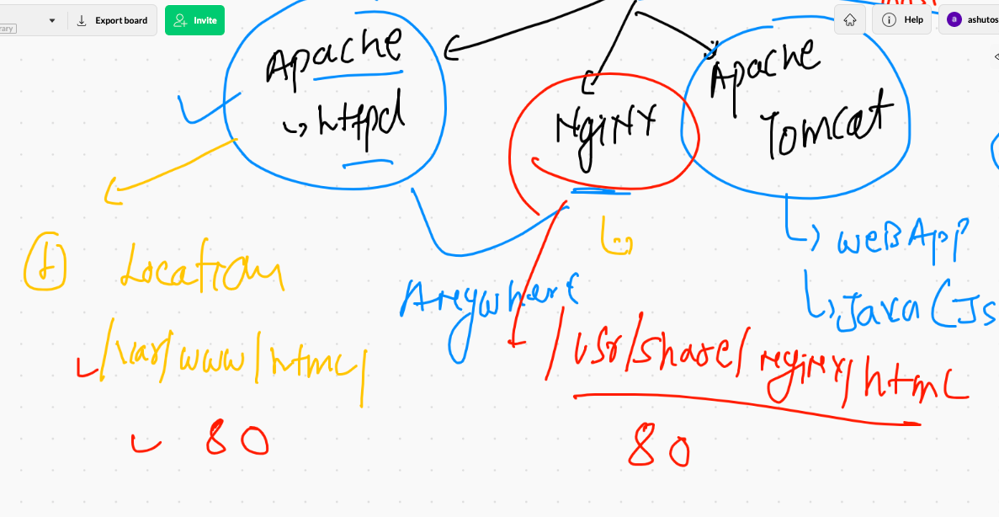
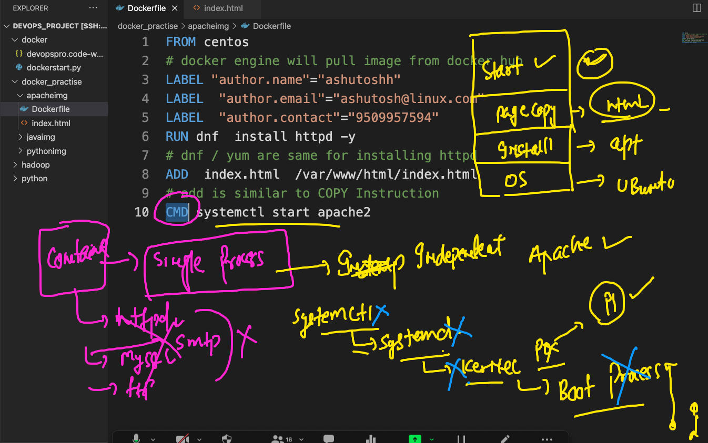

# Docker permission 



## adding non root user into docker group

```
ubuntu@ip-172-31-51-76:~$ sudo  usermod  -aG docker  ubuntu 
ubuntu@ip-172-31-51-76:~$ 
ubuntu@ip-172-31-51-76:~$ grep docker  /etc/group
docker:x:998:ubuntu
ubuntu@ip-172-31-51
```

## Web server containerization process

### list of web sever 



### apache httpd vs nginx 



### container does not support systemd by default 



